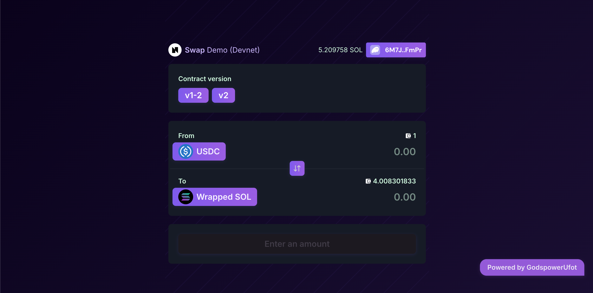

# Godspower Ufot — Neon Solana Native Swap Demo (Customized)

## ✨ About This Customization

This project is a creative fork and rebranding of the Neon EVM Solana-native swap demo, made for the **godspowerufot** brand. It shows how to swap tokens using a Solana wallet on Neon EVM, with custom tokens, liquidity pools, a simple modern UI, and automatic backend/frontend token sync.

---

## 🚀 Customizations & Enhancements

### 1. **Token Customization**

- Three new tokens deployed:
  - **Godspower Token** (`GOOD`)
  - **Web3 Power** (`WEB3`)
  - **Gift Token** (`GIFT`)
- All token names, symbols, and icons updated in backend and frontend.

### 2. **Liquidity Pool Configuration**

- New pools created:
  - `GOOD/WEB3` (5000/10000)
  - `GOOD/GIFT` (3000/6000)
- Pools set up with simple demo ratios.

### 3. **Frontend UI Branding**

- Simple, web3-style color palette and gradients.
- Custom token icons and names.
- Footer and header now show:
  - **Godspower Ufot** branding
  - Social links:
    - [GitHub (Org)](https://github.com/Godspowerufot)
    - [Discord: @godspowerufot](https://discord.com/users/godspowerufot)
    - [Twitter](https://twitter.com/ufotgodspower8)
- "Powered by Godspower Ufot" badge in the UI.
- Buttons, tabs, and token selection improved for a better experience.

### 4. **Automated Token Sync**

- Script (`scripts/sync-frontend-tokens.js`) added to auto-sync deployed token addresses from backend to frontend config.
- Frontend always shows the correct tokens after each deployment.

### 5. **.env, Hardhat, and Wallet Config**

- All environment and wallet configs are valid and easy to set up.

---

## 🟢 Results

- **Swap works and is tested!**
- **Deployed Token Addresses (curvestand):**

  - **Token A:**
    - EVM: `0x2Fd82A7c5567AbFaFC9f789056Bd1d4070625D60`
    - SPL: `HcPLHPLk8xZyppjHt4w1H2x1KyK3jDUwQnTLVYsrpyt7`
  - **Token B:**
    - EVM: `0xF06C25C608ffC48a514E4d9aDD8f69f8f2D14162`
    - SPL: `BANCA8FsU5v9uhgCPb8dUQtZJK4KDbxmhViQwVZgosQG`

- No breaking changes—core swap logic and contract interactions still work.
- **Automated token sync**: The sync script checks both `pancakeswap/artifacts/deployed-tokens.json` and `pancakeswap/deployed-tokens.json` for reliability.

---

## 👤 Branding & Socials

- **Brand:** Godspower Ufot
- **Twitter:** [@ufotgodspower8](https://twitter.com/ufotgodspower8)
- **GitHub (Org):** [@Godspowerufot](https://github.com/Godspowerufot)

---

## 🛠️ How to Use (Simple Steps)

1. **Install dependencies**

   ```bash
   cd pancakeswap && npm install
   cd ../frontend/swap-ui && yarn install
   ```

2. **Set up environment**

   - Copy `.env.example` to `.env` in both `pancakeswap` and `frontend/swap-ui`
   - Add your Solana wallet and RPC details

3. **Deploy tokens and pools**

   ```bash
   cd pancakeswap
   npx hardhat run scripts/deploy-tokens.js --network curvestand
   npx hardhat run scripts/create-liquidity-pools.js --network curvestand
   ```

4. **Sync frontend tokens**

   ```bash
   node ../scripts/sync-frontend-tokens.js
   ```

5. **Run the frontend**

   ```bash
   cd ../frontend/swap-ui
   yarn start
   ```

6. **Connect your Solana wallet** and swap custom tokens on Neon EVM!

---

## 📚 References

- [Neon EVM Solana Native SDK](https://neonevm.org/docs/composability/sdk_solana_native)
- [Using SPL Tokens on Neon](https://neonevm.org/docs/composability/using_spl_tokens)
- [Transfer SOLs with Composability](https://neonevm.org/docs/composability/using_composability/transfer_sols)
- [Neon Solana Native Swap Demo (GitHub)](https://github.com/neonlabsorg/neon-solana-native-swap-demo/tree/main)

---

**Questions? Reach out on [Twitter](https://twitter.com/ufotgodspower8), [GitHub](https://github.com/Godspowerufot), or Discord (@godspowerufot)!**

---

# Neon Solana Native Swap Demo

A simple demo of token swaps in Neon EVM using Solana signature verification. Users with Solana wallets can interact with EVM smart contracts on Neon EVM.

## About this Demo

### Purpose

This demo shows that users with a Solana wallet can use this SDK to interact with EVM smart contracts on Neon EVM.

It shows how to swap tokens in Neon EVM using the Solana signer library, bringing Solana's tokens and users to Neon EVM's smart contract world.

For more info, see the [Solana Native documentation](https://neonevm.org/docs/composability/sdk_solana_native).

### How It Works

The demo has these main parts:

1. **Smart Contracts**: Deploys PancakeSwap contracts on Neon EVM (factory and router)
2. **Token Creation**: Makes ERC20ForSPL tokens for testing
3. **Liquidity Pools**: Sets up pools for token pairs
4. **Frontend Interface**: UI for swapping tokens
5. **Proxy Server**: Handles cross-origin requests and other middleware

The flow:

- Create Neon EVM transactions
- Sign with Solana wallet
- Send to Neon EVM network via Solana
- Watch transaction status

### Repository Structure

```
├── frontend
│   └── swap-ui            # React UI for swapping tokens
├── pancakeswap            # Scripts and config for PancakeSwap deployment
│   ├── scripts            # Deployment and config scripts
```

### Prerequisites

- Node.js (v16+)
- Yarn
- Solana CLI tools
- A Solana wallet with SOL tokens (for devnet)
- Basic knowledge of:
  - Solidity and EVM smart contracts
  - Token swaps and liquidity pools
  - Solana transactions

## Getting Started

### Environment Setup

1. Clone the repository:

```bash
git clone https://github.com/neonlabsorg/neon-solana-native-swap-demo.git
cd neon-solana-native-swap-demo
```

2. Set environment variables:

For the frontend:

```bash
cd frontend/swap-ui
cp .env.example .env
# Edit .env with your info
```

For PancakeSwap deployment:

```bash
cd pancakeswap
cp .env.example .env
# Edit .env with your info
```

Key environment variables:

```
# Backend & Frontend
VITE_PROXY_ENV: devnet
VITE_SOLANA_URL: https://api.devnet.solana.com
VITE_NEON_CORE_API_RPC_URL: https://devnet.neonevm.org

# Wallet Private Keys (Never commit these to git!)
VITE_SOLANA_WALLET: <your_solana_private_key_in_bs58>
VITE_NEON_WALLET: <your_neon_private_key>

# PancakeSwap Deployment
DEPLOYER_KEY: <your_evm_private_key>
SOLANA_WALLET: <your_solana_private_key_in_bs58>
NEON_EVM_NODE: https://devnet.neonevm.org
NEON_FAUCET: https://api.neonfaucet.org/request_neon
SOLANA_RPC_NODE: https://api.devnet.solana.com
```

### Deployment

#### Deploy Smart Contracts on Devnet

1. Install dependencies:

```bash
cd pancakeswap
npm install
```

2. Run the PancakeSwap setup script to deploy all contracts:

```bash
npm run deploy
npm run airdrop
```

This will:

- Deploy WNEON contract
- Deploy PancakeSwap contracts (Factory and Router)
- Deploy ERC20ForSPL tokens (v1 and v2)
- Create token pairs and add liquidity
- Save contract addresses to the artifacts folder

For more details, see `/pancakeswap/README.md`.

#### Build and Run the Frontend

1. Install dependencies:

```bash
cd frontend/swap-ui
yarn install
```

2. Start the dev server:

```bash
yarn dev
```

### Running the Demo

1. Open the frontend in your browser (usually http://localhost:5173)
2. Connect your Solana wallet (Phantom or similar)
3. Request tokens for testing:

```bash
cd pancakeswap
npm run airdrop
```

This mints test tokens and sends them to your wallet.

4. Use the swap interface to exchange tokens

### Adapting for Your Own Use

To use this demo for your own project:

1. Change token symbols and names in `pancakeswap/scripts/deploy-tokens.js`
2. Change token amounts and pool configs in `pancakeswap/scripts/create-liquidity-pools.js`
3. Update the frontend UI in `frontend/swap-ui/src` for your brand

### Mainnet Deployment

When using mainnet:

1. Update `.env` files:
   - Use mainnet RPC endpoints
   - Remove faucet configs
2. Make sure your wallets have enough SOL and NEON
3. Update `pancakeswap/hardhat.config.js` for mainnet
4. Add error handling and transaction monitoring for production
5. Get a security audit for any contract changes
6. Use safe key management (never store private keys in code or env files in production)

## More Resources

- [Solana Native SDK Docs](https://neonevm.org/docs/composability/sdk_solana_native)
- [Neon EVM Docs](https://neonevm.org/docs/quick_start)
- [Solana Docs](https://solana.com/docs)

## License

MIT
